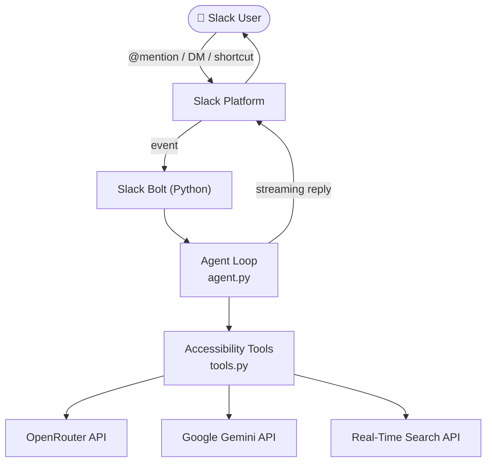

<div align="center">

# ⚓ Clarion

**The Accessibility Layer for Slack**

*Making every workplace conversation easier to understand for everyone.*

[](https://github.com/HARJAPAN2005/Clarion-The-Accessibility-Companion-for-Slack/actions/workflows/ci.yml)
[](https://github.com/HARJAPAN2005/Clarion-The-Accessibility-Companion-for-Slack/actions/workflows/codeql.yml)
[](https://www.python.org/downloads/)
[](LICENSE)
[](https://github.com/astral-sh/ruff)
[](https://github.com/slackapi/bolt-python)

[Features](#features) · [Quickstart](#quickstart) · [Architecture](#architecture) · [Documentation](#documentation) · [Contributing](#contributing)

</div>

---

## What is Clarion?

Clarion is an open-source AI-powered Slack application that reduces communication barriers in the workplace. It makes conversations more accessible to neurodivergent colleagues, non-native English speakers, people who are blind or have low vision, and anyone who finds dense workplace language difficult to parse.

**Clarion works where your team already works** — inside Slack, via `@Clarion` mentions, direct messages, and message shortcuts. No new tools. No context switching.

---

## The Problem

Workplace communication is broken for millions of people:

- Dense, jargon-heavy messages exclude non-native English speakers and neurodivergent colleagues.
- Images shared in Slack have no alt-text — screen-reader users receive nothing.
- Long threads take 20 minutes to read. People returning from leave either skip them or miss decisions.
- Acronyms and internal shorthand alienate newcomers.
- Drafts full of idioms accidentally exclude whole groups of people.

None of this is intentional. Most people just communicate the way they always have. Clarion fills the gap — silently, respectfully, and without changing how anyone works.

---

## Features

### ✨ Simplify Message

Rewrites any message into plain language, preserving every decision, owner, deadline, and action item. Choose from four reading levels in the App Home.

**Before:**
> "We need to leverage our bandwidth to circle back on the Q3 OKRs and operationalize the synergies before EOD."

**After:**
> "We need to use our available time to follow up on the Q3 goals and put our plan into action before 5pm today."

---

### 🖼 Describe Image

Generates a screen-reader-ready alt-text sentence and a full visual description for any image uploaded to Slack. Slack images have no alt-text by default — this is a significant accessibility gap.

---

### 📌 Catch Me Up

Turns a long thread into a structured plain-language digest:
- Decisions made
- Who needs to do what (and by when)
- Key dates and deadlines
- What is still being worked out

---

### 💡 Define Term

Explains internal jargon, project names, and acronyms using live workspace context from the Real-Time Search API. Definitions are warm and non-condescending — Clarion treats readers as intelligent, just unfamiliar.

---

### 🌍 Inclusive Check

Reviews a draft message for barriers before it's sent: idioms, unexplained acronyms, and phrasing that may be unclear to non-native speakers or neurodivergent colleagues. Suggests complete sentence rewrites, not just word swaps.

---

### ⚙️ Per-User Preferences

Each user configures Clarion independently in the App Home:
- **Reading level** — Grade 5, Grade 8, Plain, or Concise
- **Output language** — Spanish, French, Hindi, Mandarin, Arabic, Portuguese, or English
- **Auto alt-text** — automatically describe images in conversations

---

## Quickstart

### Prerequisites

- Python 3.10 or higher
- A Slack workspace where you can install apps

### Installation

```bash
# 1. Clone the repository
git clone https://github.com/HARJAPAN2005/Clarion-The-Accessibility-Companion-for-Slack.git
cd Clarion-The-Accessibility-Companion-for-Slack

# 2. Create and activate a virtual environment
python -m venv .venv
source .venv/bin/activate         # Linux / macOS
# .venv\Scripts\activate           # Windows

# 3. Install dependencies
pip install -r requirements.txt

# 4. Configure environment variables
cp .env.example .env
# Edit .env with your Slack tokens and API keys

# 5. Start Clarion
python app.py
```

### Environment Variables

| Variable | Required | Description |
|---|---|---|
| `SLACK_BOT_TOKEN` | Yes | Bot user OAuth token (`xoxb-...`) |
| `SLACK_APP_TOKEN` | Yes | App-level token for Socket Mode (`xapp-...`) |
| `OPENROUTER_API_KEY` | Recommended | OpenRouter API key for text models |
| `GEMINI_API_KEY` | Recommended | Google Gemini API key for image descriptions |
| `SLACK_RTS_TOKEN` | Optional | Real-Time Search API token |

See [`.env.example`](.env.example) for the full list with descriptions.

### Slack App Setup

1. Create a new app at [api.slack.com/apps](https://api.slack.com/apps).
2. Choose **From a manifest** and paste the contents of [`manifest.json`](manifest.json).
3. Install to your workspace.
4. Copy the **Bot User OAuth Token** and **App-Level Token** into your `.env`.

> **No API keys?** Clarion works without them. Every feature has a deterministic offline fallback — you'll see mechanical text simplification, rule-based inclusive checks, and a built-in jargon glossary when AI services are unavailable.

---

## Architecture



Clarion uses a standard Slack Bolt event → listener → agent → tool → response flow. The agent loop runs up to 6 iterations, dispatching tool calls until the model produces a final text reply. Every tool degrades gracefully to an offline fallback.

See [docs/Architecture.md](docs/Architecture.md) for full Mermaid diagrams covering the request flow, LLM pipeline, Slack event routing, and deployment architecture.

---

## Project Structure

```
clarion/
├── app.py               Entry point — Socket Mode (local dev)
├── app_oauth.py         Entry point — HTTP + OAuth (Slack MCP Server)
├── agent.py             AI agent loop, tool dispatch, streaming
├── tools.py             Five accessibility tool implementations
├── config.py            Centralised configuration and AI client factories
├── thread_context.py    In-memory session and preference stores
├── rts_client.py        Real-Time Search API client
├── slack_mcp.py         Slack MCP Server / Web API bridge
├── manifest.json        Slack app definition (scopes, shortcuts, events)
├── listeners/           Slack event, action, and shortcut handlers
├── tests/               Pytest test suite (offline, no API keys required)
└── docs/                Full documentation
```

---

## Documentation

| Document | Description |
|---|---|
| [Architecture](docs/Architecture.md) | System design and Mermaid diagrams |
| [API Reference](docs/API.md) | Internal tool and agent interface docs |
| [Developer Guide](docs/DeveloperGuide.md) | Setup, workflow, adding tools |
| [Accessibility](docs/Accessibility.md) | Feature deep-dive and WCAG alignment |
| [Deployment](docs/Deployment.md) | Socket Mode, Docker, cloud platforms |
| [Troubleshooting](docs/Troubleshooting.md) | Common issues and fixes |
| [FAQ](docs/FAQ.md) | Frequently asked questions |

---

## Technology Stack

| Technology | Purpose |
|---|---|
| [Slack Bolt for Python](https://github.com/slackapi/bolt-python) | Event handling, Socket Mode, OAuth |
| [OpenRouter](https://openrouter.ai) | Text model API (model-agnostic) |
| [Google Gemini API](https://ai.google.dev) | Vision model for image descriptions |
| [Slack Real-Time Search API](https://api.slack.com/methods/search.messages) | Live workspace context for jargon definitions |
| [Slack MCP Server](https://api.slack.com/automation/agents) | Governed thread history access |

---

## Docker

```bash
# Build
docker build -t clarion:latest .

# Run
docker run --rm --env-file .env clarion:latest

# Or with Docker Compose
docker compose up
```

See [docs/Deployment.md](docs/Deployment.md) for HTTP + OAuth and cloud deployment instructions.

---

## Roadmap

See [ROADMAP.md](ROADMAP.md) for the full roadmap. Highlights:

- **v1.x**: Persistent Redis preference store, rate limiting, reading complexity scores, additional language support
- **v2.0**: Proactive accessibility monitoring, workspace analytics dashboard, custom jargon glossary, Workflow Builder integration

---

## Contributing

Contributions are welcome. Please read [CONTRIBUTING.md](CONTRIBUTING.md) before opening a pull request.

Quick setup:

```bash
pip install -e ".[dev]"
make check   # lint + typecheck + test
```

Looking for a place to start? Check the issues labelled [`good first issue`](https://github.com/HARJAPAN2005/Clarion-The-Accessibility-Companion-for-Slack/issues?q=is%3Aopen+label%3A%22good+first+issue%22).

---

## License

Clarion is released under the [MIT License](LICENSE).

---

## Acknowledgements

Built with [Slack Bolt for Python](https://github.com/slackapi/bolt-python), [OpenRouter](https://openrouter.ai), and [Google Gemini](https://ai.google.dev).

Clarion is committed to removing barriers so everyone can participate fully in the conversations that shape their work.

---

<div align="center">
  <sub>Open source accessibility for Slack · MIT License</sub>
</div>
