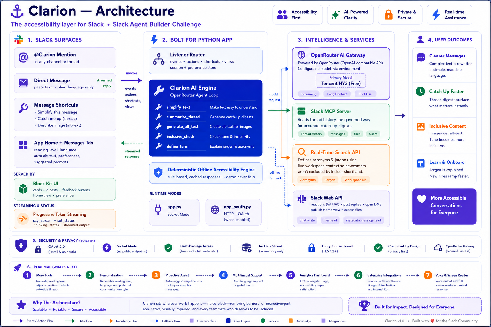

<div align="center">
  

  # ⚓ Clarion 
  **The Accessibility Layer for Slack**

  <p align="center">
    <a href="https://api.slack.com/automation/agents">Slack Agent Builder Challenge</a> •
    <a href="#features">Features</a> •
    <a href="#quickstart">Quickstart</a>
  </p>
</div>

---

> **🏆 Track: Slack Agent for Good (Accessibility)**

Clarion makes every Slack conversation accessible to everyone — neurodivergent colleagues, people with cognitive or reading differences, non-native English speakers, people who are blind or have low vision, and anyone joining a thread late. **It's an inclusion layer that works wherever your team already works.**

## 🚀 The Stack: Next-Gen Slack Automation

Clarion is fully powered by **all three eligible challenge technologies**, beautifully orchestrated by the Slack Bolt framework for Python:

| Tech | What it is | How Clarion uses it |
| :--- | :--- | :--- |
| **① Slack AI** | Claude Agent SDK / AI Primitives | Plain-language rewrites, image descriptions (vision!), catch-up digests, and tone checks with seamless UI streams. |
| **② Slack MCP Server** | Model Context Protocol | secure, governed reads of deep thread history for highly accurate, hallucination-free thread summaries. |
| **③ Real-Time Search API** | Enterprise Search | Live, workspace-scoped search to instantly define internal jargon, project names, and acronyms that newcomers might not know. |

---

## ✨ What it Does (Features)

Clarion integrates directly into the conversational surfaces your team uses every day via `@Clarion` mentions, Direct Messages, and **Message Shortcuts**. 

- 🧠 **Simplify (The Core)** — Rewrites jargon-heavy, overly dense messages into clear plain language. It preserves *every* decision, owner, date, and action item, while dropping the corporate fluff.
- 📸 **Describe Image (Gemini Vision)** — A massive accessibility win. Generates detailed, concise screen-reader alt-text for images uploaded to Slack (which normally lack alt-text), powered by Gemini 3.5 Flash.
- 📚 **Catch Me Up** — Turns a 40-message deep thread into a tight, plain-language digest. Who decided what? What are the deadlines? What's still open? Clarion knows.
- 📖 **Define a Term** — Don't know what the "T-800 OKR" means? Clarion queries the live Slack workspace using the Real-Time Search API to explain it to you privately.
- 🤝 **Inclusive Check** — Flags idioms, unexplained acronyms, and exclusionary phrasing in a draft *before* it's sent to the team.
- ⚙️ **Per-User Preferences** — Tweak Clarion in the App Home. Choose your reading level (Grade 5, Grade 8, Concise), output language, and auto alt-text preferences.

---

## 🛠️ Quickstart (Run it locally)

Want to see Clarion in action? It takes 2 minutes to spin up locally in Socket Mode.

> **Prerequisites:** [Slack CLI v4+](https://api.slack.com/automation/cli) and Python 3.10+

```bash
# 1. Install the Slack CLI (if you haven't)
curl -fsSL https://downloads.slack-edge.com/slack-cli/install.sh | bash
slack login

# 2. Clone the repo and install dependencies
git clone https://github.com/HARJAPAN2005/Clarion-The-Accessibility-Companion-for-Slack.git
cd Clarion-The-Accessibility-Companion-for-Slack
python -m venv .venv
source .venv/bin/activate  # Or .venv\Scripts\activate on Windows
pip install -r requirements.txt

# 3. Setup Secrets
cp .env.sample .env
# Open .env and fill in:
# - SLACK_BOT_TOKEN (xoxb-...)
# - SLACK_APP_TOKEN (xapp-...)
# - OPENROUTER_API_KEY (for text models)
# - GEMINI_API_KEY (for Vision/Image descriptions)

# 4. Fire it up!
slack run
```

Then jump into your Slack workspace: DM Clarion, `@Clarion` it in a channel, or use the message shortcuts (the `···` menu on any message)!

> 💡 **No API keys handy?** Clarion is built with extreme resilience. Every tool has a **deterministic offline fallback** so the demo *never* dead-ends. You'll see mechanical text simplification, a built-in RTS glossary demo, and rule-based inclusive checks if the APIs aren't reachable.

---

## 🧠 Advanced Setup

### The Slack MCP Server (Technology ②)
The catch-up digest reads thread history through the **Slack MCP Server** when Clarion runs in HTTP/OAuth mode:

```bash
ngrok http 3000
# In manifest.json: set socket_mode_enabled=false and point redirect_urls to your ngrok domain
slack install -E local

# In Slack App Settings -> Agents -> Toggle "Model Context Protocol" ON
# Copy the Client ID / Secret / Signing Secret + your ngrok redirect into .env
export SLACK_MCP_ENABLED=true
slack run app_oauth.py
```
*(Note: In Socket Mode, the digest gracefully falls back to using `conversations.replies` so you can always demo it!)*

### The Real-Time Search API (Technology ③)
Set `SLACK_RTS_TOKEN` (and optionally `SLACK_RTS_ENDPOINT`) in `.env`. Without a token, `define_term` uses a tiny, built-in workspace glossary so you can still experience the feature offline.

---

## 📂 Project Architecture

```text
clarion/
├── manifest.json            # 📄 App definition: scopes, events, shortcuts, agent config
├── app.py                   # 🔌 Socket Mode entry point (Default)
├── app_oauth.py             # 🌐 HTTP + OAuth entry (Enables the Slack MCP Server)
├── agent.py                 # 🧠 Claude Agent SDK loop + Tool router
├── tools.py                 # 🛠️ The 5 accessibility tools (with robust offline fallbacks)
├── rts_client.py            # 🔍 Real-Time Search API client
├── slack_mcp.py             # 🤝 Slack MCP Server helper
├── thread_context.py        # 💾 Session + Per-user preference state store
└── listeners/               # 🎧 The nervous system
    ├── events/              # app_mention, message, app_home_opened
    ├── actions/             # feedback buttons + Home preference controls
    ├── shortcuts/           # simplify / alt-text / catch-me-up message shortcuts
    └── views/               # Home tab + feedback Block Kit
```

---

<div align="center">
  <p>Built with ❤️ for the Slack Agent Builder Challenge.</p>
  <p><i>Removing barriers so teams can just communicate.</i></p>
</div>
