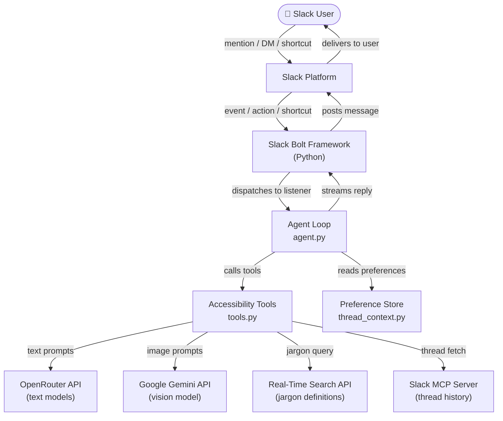
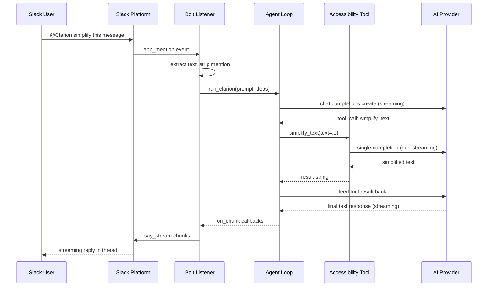
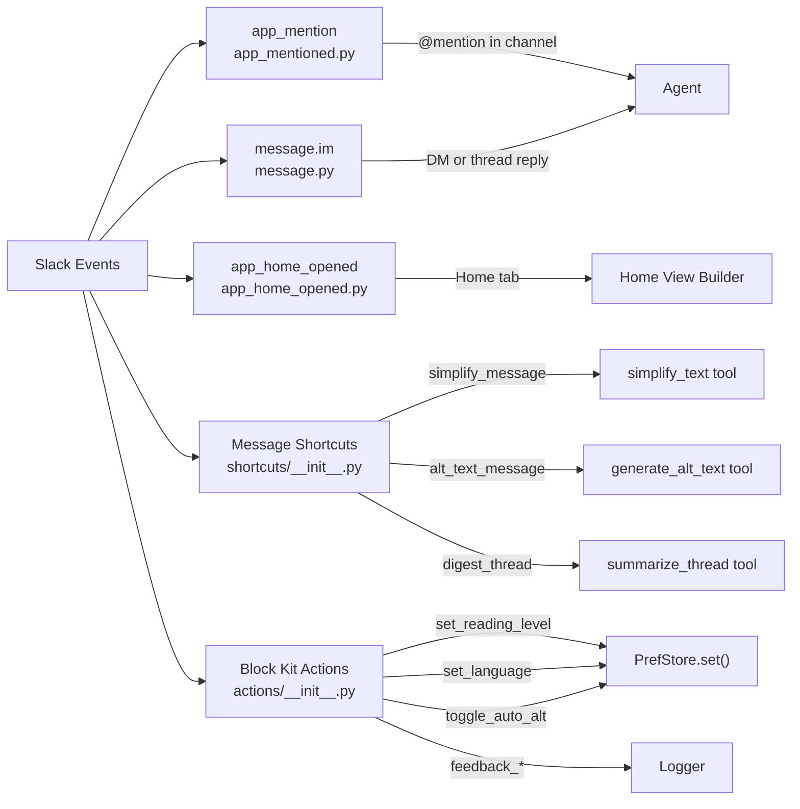
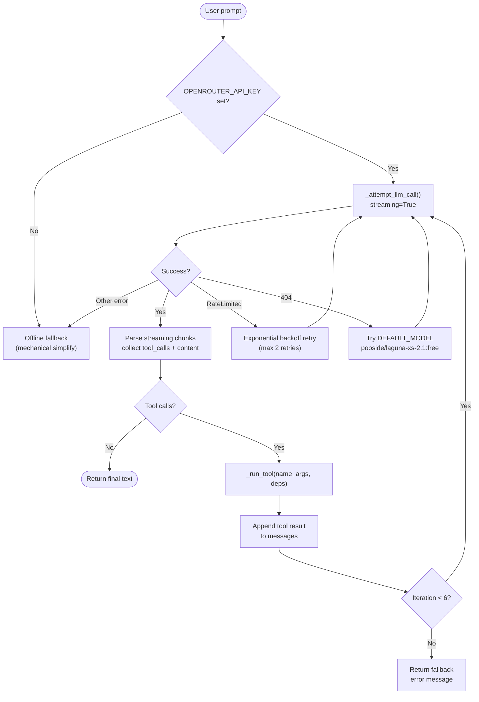
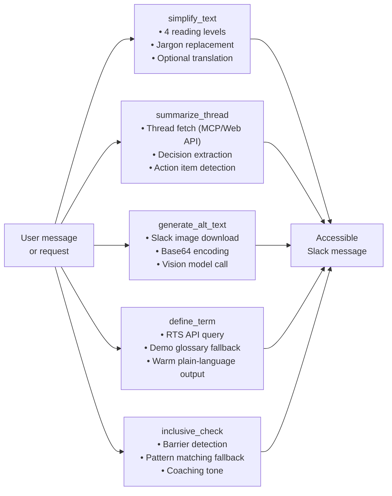
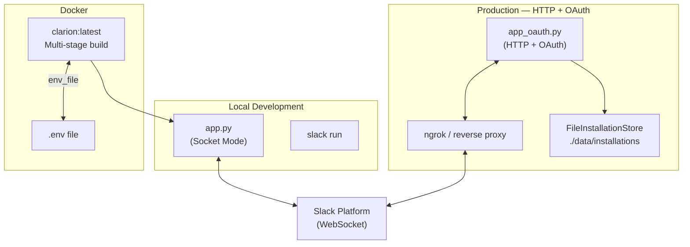

# Architecture

This document describes how Clarion works internally — from receiving a Slack
event to delivering an accessible response.

---

## System Overview

Clarion is a Slack application that processes user requests through an AI agent
loop, dispatches to specialised accessibility tools, and streams results back
into Slack in real time.

---

## Request Flow

---

## Slack Event Flow

---

## LLM Processing Pipeline

---

## Accessibility Pipeline

---

## Deployment Architecture

---

## Module Responsibilities

| Module | Responsibility |
|---|---|
| `app.py` | Socket Mode entry point, startup diagnostics |
| `app_oauth.py` | HTTP + OAuth entry point, Slack MCP Server |
| `agent.py` | AI agent loop, tool dispatch, streaming |
| `tools.py` | Five accessibility tool implementations |
| `config.py` | Environment variables, AI client singletons |
| `thread_context.py` | Session tracking, user preferences |
| `rts_client.py` | Real-Time Search API client |
| `slack_mcp.py` | Slack MCP Server / Web API bridge |
| `listeners/events/` | Slack event handlers (mention, DM, home) |
| `listeners/actions/` | Block Kit button and select handlers |
| `listeners/shortcuts/` | Message shortcut handlers |
| `listeners/views/` | Block Kit view builders (home, feedback) |
| `listeners/_stream.py` | Defensive Bolt streaming helper |
